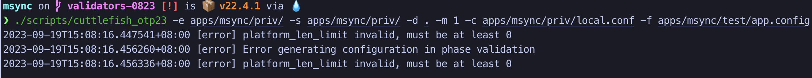
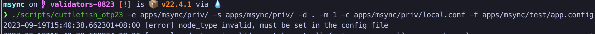
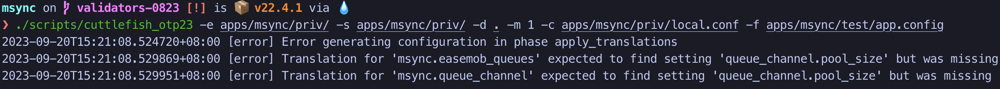

# 配置文件

## validators
在`schema`文件中可以为`mapping`编写`validator`函数，去执行一些更高级的校验。

例子1：

限制某个配置的取值范围
``` erlang
{mapping, "platform_len_limit", "msync.platform_len_limit", [
  {default, 10},
  {datatype, integer},
  {validators, [">=0", "<=50"]}
]}.

{validator, ">=0", "must be at least 0",
 fun(V) ->
    V >= 0
 end}.
{validator, "<=50", "50 and larger are not supported",
 fun(V) ->
    V =< 50
 end}.
```
如果把`platform_len_limit`的值设置为`-1`，生成配置文件会打印如下报错：


例子2:

检查某个配置必须在`conf`文件配置
``` erlang
{mapping, "node_type", "msync.node_type", [
  {default, none},
  {datatype, atom},
  {validators, ["must_config", "node_type"]}
]}.

{validator, "must_config", "must be set in the config file",
 fun(V) ->
  V =/= none
 end}.
```
如果在`conf`文件中没有配置，会打印如下报错：


例子3:

检查一组配置是否都有配置
```erlang
%% easemob queues
{mapping, "easemob_queues", "msync.easemob_queues", [
  {default, "queue_channel,queue_group_channel,queue_offline,queue_presence_session,queue_reaction,queue_ets"},
  {datatype, string}
]}.

{ translation,
  "msync.easemob_queues",
    fun(Conf) ->
        AllQueues = cuttlefish:conf_get("easemob_queues", Conf),
        Queues = string:tokens(AllQueues, ","),
        lists:foreach(fun(Queue) -> 
            cuttlefish:conf_get(Queue ++ ".pool_size", Conf)
        end, Queues),
        [erlang:list_to_atom(Queue) || Queue <- string:tokens(AllQueues, ",")]
    end
}.
```

如果`easemob_queues` 依赖的 `pool_size` 没有配置，会打印如下报错：


## 单元测试
``` erlang
   %% 仅通过schema文件生成配置
   Config = cuttlefish_unit:generate_templated_config(
               "../../lib/msync/priv/msync.schema", [], []),
   %% assert validator 设置的错误信息
   ok = cuttlefish_unit:assert_error_message(Config, "platform_len_limit invalid, must be at least 0").

```

``` erlang
   %% 通过 config 和 schema 共同生成配置
   LocalConfig = [{["platform_len_limit"], 10}],
   Config = cuttlefish_unit:generate_templated_config(
      "../../lib/msync/priv/msync.schema", LocalConfig, []),
   %% assert 生成的配置是否符合预期
   ok = cuttlefish_unit:assert_config(Config,   "msync.platform_len_limit", 10),
   %% assert 是否没有生成此配置
   ok = cuttlefish_unit:assert_not_configured(Config, "msync.roam_server").

```